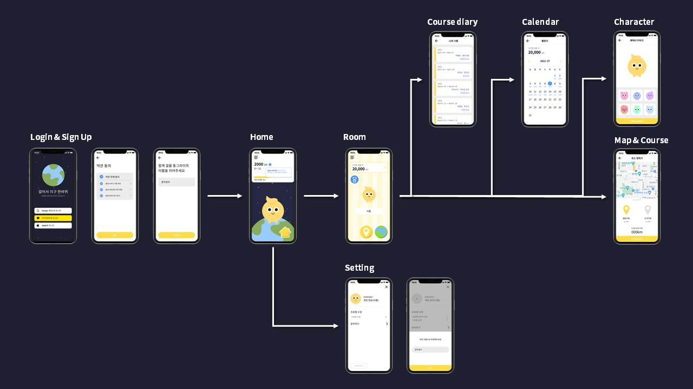

# Earth1Round Server

**우리는 지금까지 얼마만큼 걸었을까요?🧐** 라는 질문에서 우리의 프로젝트는 시작되었습니다. <br>
우리의 한 걸음, 한 걸음은 **동그라미 친구**들을 만나 함께 **지구탐험**🌐을 할 수 있어요. <br>


## Environment
- Language
```markdown
- Java 15
```
- Framework & dependencies
```markdown
- Spring Boot v2.7.1
- JPA
- jsonwebtoken
- lombok
- validation
```
- Database
```markdown
- MySQL
```
- Infra
```markdown
- AWS EC2
- Ubuntu 20.04
```

## Features

### 로그인 API
- Kakao, google 소셜 로그인

### 프로필 API
- 유정 정보 조회
- 닉네임 설정

### 코스 API
- 현재 코스 조회 - 사용자가 저장한 코스들 중 현재 진행중인 코스를 조회
- 완료한 코스 리스트 조회 - 사용자 기록에 들어갈 완료한 코스의 목록을 시간순으로 조회
- 코스 저장 - 선택한 출발지와 목적지를 저장 
- 코스 완료 처리 - 진행중인 코스가 완료되었을 때 완료 처리

### 캐릭터 API
- 캐릭터 번호 조회 - 현재 사용자의 캐릭터 번호 조회
- 캐릭터 번호 수정 - 사용자의 캐릭터 번호 변경

## App Flow


